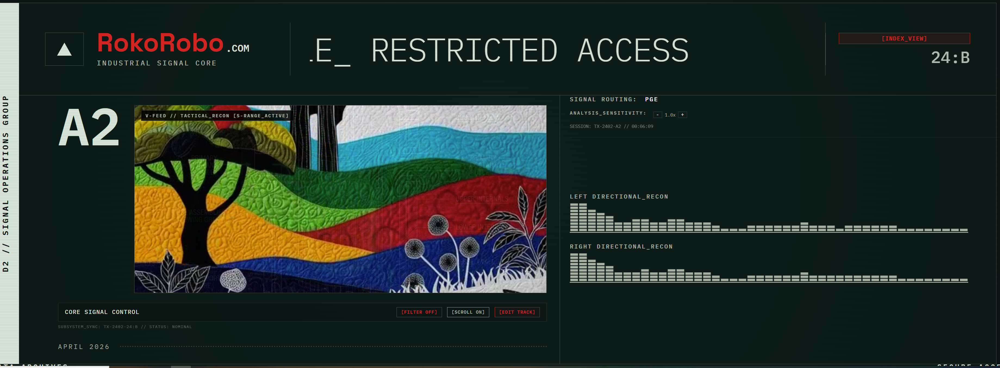

# RokoRobo Live Engine // DJBoard II
### [INDUSTRIAL_SIGNAL_CORE] TACTICAL MONITOR & RECON CONSOLE

A high-performance, cinematic live-performance dashboard designed for real-time audio visualization, beat-synced video replay, and mission-critical status monitoring.

---

## 🛰️ TACTICAL FEATURES

### 📡 V-FEED // TACTICAL_RECON
- **Zero-Type Logic:** Automatically detects and appends `.mp4` to track names.
- **Dynamic Playback:** Integrated high-fidelity video replay synced directly to the session track.
- **Integrated Fallback:** Automatic switch to an **Image Sequencer** (Recon Frames) if video assets are missing.
- **Horizon Sync Calibration:** A massive 460px vertical surveillance frame aligned with the analysis floor.

### 📊 HORIZON_SYNC ANALYSIS
- **Symmetrical Monitoring:** A 50/50 dashboard split ensuring total horizontal and vertical balance across the UI.
- **Consolidated Telemetry Hub:** Vertical stack for **Signal Routing (PGE)**, **Analysis Sensitivity**, and **Session Tracking**.
- **Beat-Synced Spectrometry:** Responsive L/R Directional recon bars with gain-adjustable sensitivity.

### 📜 HEADER_MARQUEE // DUAL_VIEW
- **Primary View:** Large-scale scrolling track marquee for maximal visibility.
- **Secondary View:** Instant toggle to the **System Index [INDEX_VIEW]** for audio/visual setup.
- **Interactive Controls:** Toggle scroll speed and active track data on-the-fly.

---

## 🛠️ DEPLOYMENT & RECON ASSETS

### **1. Video Assets (`live/videos/`)**
Place all high-fidelity `.mp4` files here. 
- **Naming Rule:** File names must match the track names exactly (e.g., `Spheral Hell.mp4`).
- **Support:** The engine automatically handles spaces and special characters.

### **2. Recon Frames (`live/frames/`)**
Place signal-feed sequences (`frame1.png`, `frame2.png`, etc.) here for the fallback visualizer.

### **3. Session Initialization**
Access the **[INDEX_VIEW]** or use the **[EDIT TRACK]** button to establish your active session path.

---

## 🌑 DESIGN AESTHETIC
- **Cinematic Industrial UI:** Stealth-green monochrome with military-grade typography and glass-morphic textures.
- **Dynamic Resize Optimization:** All canvas elements (Audiometers) and video layers utilize high-performance `requestAnimationFrame` rendering.
- **Zero-Clipping Layout:** All telemetry is vertically stacked and safety-buffered for 100% monitor visibility.

---

### // SECURE_ACCESS // DATA_ARCHIVES_LINKED
> **ROKOROBO INDUSTRIAL CORE [VER_SYNC: 24:B]**
